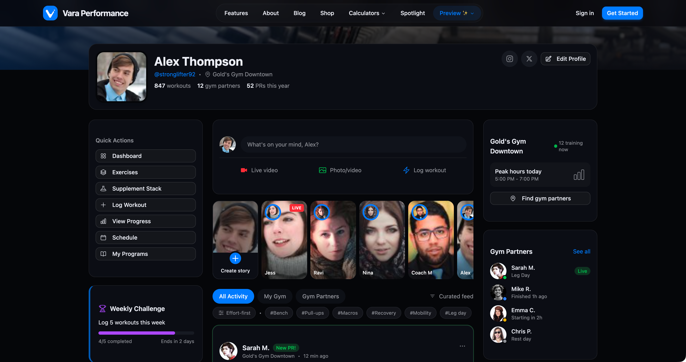

# Vara Performance

**A fitness app that gives a shit about your training.**

---

## Why we built this

Every social media app out there is the same. Open it up and you're hit with a feed full of mirror selfies, transformation photos that are mostly lighting tricks, and "fitness influencers" selling you protein powder with affiliate codes.

The actual training? Buried. Your progress data? Sold to advertisers. The algorithm? Designed to keep you scrolling, not lifting.

And every fitness app? Paywalled to hell. Want to scan a barcode to log your food? That'll be $9.99/month. Want to see your macros? Premium feature. Track more than 3 workouts per week? Time to upgrade.

We're competitive athletes. We got tired of it. So we built what we actually wanted to use.

**Vara Performance won't paywall the features you need to reach your goals:**

- ✓ Barcode scanning for food logging  
- ✓ Macro tracking and management  
- ✓ Unlimited workout logging  
- ✓ Progress analytics and charts  
- ✓ Exercise library with videos  
- ✓ Custom program builder  
- ✓ Data export (your data is yours)

Vara Performance tracks your workouts, shows you real progress over time, and connects you with people who actually train—not people who want followers. No follower counts. No likes on photos. No sponsored content in your feed.

Just training.

---

## How it works

### Log your training

Track sets, reps, weight, RPE—whatever matters for your program. We support everything from powerlifting to CrossFit to bodybuilding to general fitness. Import from other apps if you're switching over. Your history comes with you.

### See actual progress

Not just "you worked out 4 times this week, great job!" We show you strength curves, volume trends, estimated 1RMs, muscle group balance, and recovery patterns. The kind of data that actually helps you train better.

### Own your data

This is a big one. Your workout data belongs to you. We don't sell it. We don't use it to train models without asking. You can export everything—JSON, CSV, whatever format you need—anytime you want. If you delete your account, your data is actually deleted. Not "deleted."

### Find gym partners

Not followers. Partners. People who train at your gym, around your schedule. You can sync up for sessions, spot each other, run programs together. Mutual accountability with people you actually see in person.

### Customize your profile

Remember when the internet let you make things your own? Custom colors, themes, layouts. Pin the lifts you care about. Show the stats that matter to you. Your profile should look like yours, not identical to everyone else's.

---

## The feed is different

Most fitness apps reward engagement. Post a shirtless photo, get likes, feel good, post more photos. The actual training becomes secondary to the content creation.

We flipped it.

Our feed prioritizes posts with logged workout data. Hit a PR and share it? That gets visibility. Post a photo with no training attached? It shows up, but it's not getting boosted. We literally de-prioritize content that's just photos without workout data.

The result: your feed is full of people actually training, hitting PRs, running programs, making progress. Not people posing.

| What we don't do | What we do instead |
|:--|:--|
| Follower counts | Consistency streaks |
| Likes on photos | High-fives on logged workouts |
| Sponsored posts | Nothing. No ads. |
| Selling your data | Letting you export and delete it |
| Algorithmic addiction loops | Chronological feed option |

---

## Coaching that's actually legit

We built a coaching marketplace into the platform. But here's the thing—every coach on Vara Performance is verified.

That means real credentials. NSCA-CSCS. ACSM. NASM. USAW. Actual certifications from actual accredited organizations. We check them before anyone can take clients.

No "self-taught fitness entrepreneurs." No influencers who got big on social media and decided that means they can charge $200/month for cookie-cutter PDFs.

Coaches can see your training logs, your progress, your metrics. They write programs specifically for you, delivered right in the app. Check-ins, messaging, scheduling—all handled. We process payments so coaches don't have to chase invoices and you don't have to venmo strangers.

You can find coaches for online programming or filter by location for in-person training in your city.

---

## Who this is for

People who take their training seriously but are tired of the fitness industry's bullshit.

You don't need to be elite. You don't need to compete. You just need to care about getting better and want tools that help you do that without all the noise.

If you want an app that'll boost your engagement and help you build a following, this isn't it. Go use Instagram.

If you want an app that tracks your lifts, shows you real data, connects you with training partners, and stays out of your way—we built this for you.

---

### 50,000+ people are already here.

 

 

Questions? [hello@varaperformance.com](mailto:hello@varaperformance.com)

*© 2026 Vara Performance*

