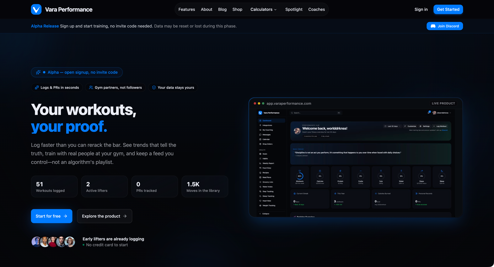
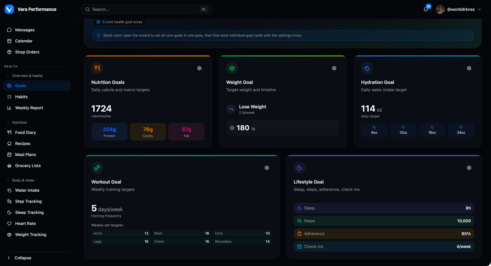
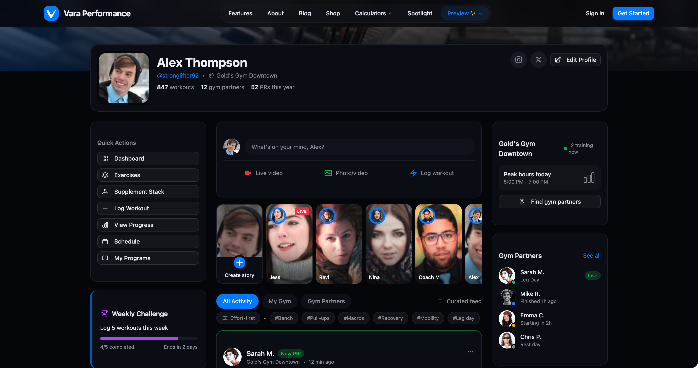
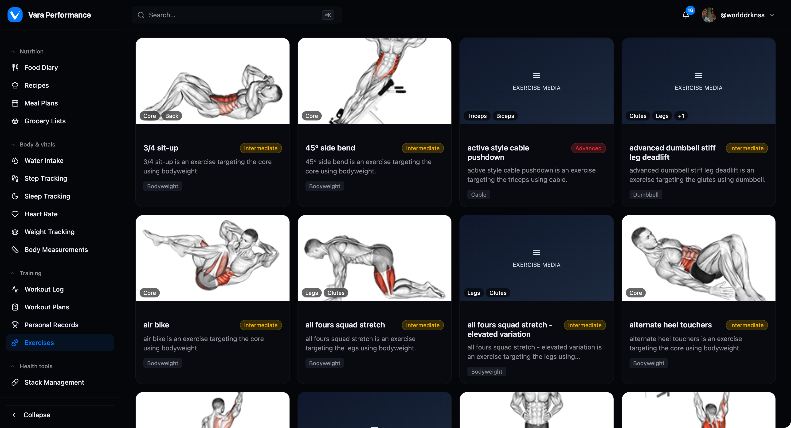

<picture>
  
</picture>

 

# Vara Performance

**Train harder. See proof. No paywalls.**

`Barcode scan macros` · `Unlimited workouts` · `Real progress data` · `Ad-free health tools`

---

## Why athletes switch to Vara

- **No paywalls for the essentials** — Macros, barcode scan, unlimited workout logging, progress charts: free.
- **Data that actually helps you train** — Strength curves, volume trends, estimated 1RMs, balance by muscle group.
- **Partners, not followers** — Find people who lift where you lift. Spot each other, share PRs, stay accountable.
- **You own your data** — Export any time (CSV/JSON). Delete your account = data gone. Ad-free health tools. No selling.

 

<picture>
  
</picture>

🍎 Macro Calculator — Set targets, scan barcodes, track everything. Free forever.

---

## What you get on day one

| Feature | Outcome |
|:--|:--|
| Barcode scanning + macro calculator | Know exactly what you eat without spreadsheets or subscriptions. |
| Unlimited workout logging | Track sets, reps, weight, RPE for every program you run. |
| Progress analytics | See strength curves, volume trends, estimated 1RMs, recovery patterns. |
| Exercise library with video | Pull the right movement fast; filter by muscle, equipment, difficulty. |
| Custom program builder | Build or tweak cycles and keep history intact. |
| Full data export | CSV/JSON anytime. Your data, not ours. |
| Health tools | Always ad-free. |

---

## Product snapshots

<picture>
  
</picture>

📱 Feed — PRs and logged training surface first. Selfies do not.

 
 

<picture>
  
</picture>

🏋️ Exercise Library — Video guides for every movement. Filter by muscle, equipment, difficulty.

---

## How it keeps you accountable

- **Session structure**: Log sets/reps/weight/RPE; import history from other apps so you never start over.
- **Progress receipts**: Volume and intensity trends show whether your programming is working.
- **Partner matching**: Train with people at your gym and schedule sessions; no follower-chasing.
- **Chronological feed**: Posts with real workout data get priority; no algorithmic rabbit holes.

---

## Coaching without the BS

Every coach is credential-verified: **NSCA-CSCS** · **ACSM** · **NASM** · **USAW**.

> Coaches see your logs and metrics, deliver programs in-app, handle check-ins, messaging, scheduling, and payments. You focus on lifting; they focus on programming.

No self-proclaimed gurus. No recycled PDFs.

---

## Who this is for

| Built for | Not for |
|:--|:--|
| Lifters who want data, partners, and real programming | People chasing likes and follower counts |
| Athletes who want verified coaches | Influencers selling swipe-up codes |
| Anyone tired of paywalls on basics | Anyone who wants algorithms deciding their feed |

---

© 2026 Vara Performance · Built by athletes, for athletes

